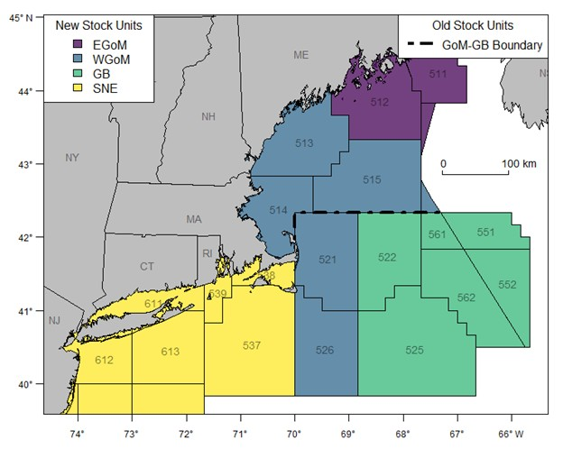

# WGOM Atlantic Cod and Haddock Trips and Catch

**Description**: 

Historical directed trips and catch for Western Gulf of Maine (WGOM) Cod and Haddock.

**Years available**: 

Trips and catch are provided for 2024 and 2025.  

## Methods

### Data sources

Data are from the Marine Recreational Information Program  ([MRIP](https://www.fisheries.noaa.gov/insight/marine-recreational-information-program)).

### Data extraction 

Data were obtained using functions in the [mriptacklebox](https://github.com/NEFSC/READ-PDB-mriptacklebox) package that was created by the Population Dynamics Branch at the NEFSC to process MRIP microdata. 

### Data analysis/Processing

[Data processing code](https://github.com/NEFSC/READ-SSB-recdashboard/blob/T1_Rec_Catch_Estimates/stored_scripts/groundfish_trips_catch.R) can be seen in the READ-SSB-recdashboard repository. 

The code builds a long-format dataframe of directed trip counts and catch (harvest, discards, total) for Atlantic Cod and Haddock in the WGOM. 

We pull trips where Cod or Haddock were caught or stated as the primary target by the angler. For trips, we ensure that trips that caught or targeted both Cod and Haddock are not double-counted. While catch is species specific, trips are not and represent a combined measure of Cod and/or Haddock trips. 

For catch, we provide harvest (landed + unobserved), discards, and catch (harvest + discards) in numbers of fish. 

#### WGOM 

WGOM trips are defined as any Maine or Massachusetts trips taken in statistical areas 513, 514, 515, 521, and 526, as well as any trips taken from New Hampshire. While we do not know exactly where someone fished, we assume fishing occurred in the statistical area closest to the MRIP intercept site where the data was collected. 

Haddock stocks are assessed in different stock areas than Cod. Haddock are assessed in the Gulf of Maine (GOM), which corresponds to statistical areas 511, 512, 513, 514, and 515. Cod are assessed in the WGOM stock area (ie, statistical areas 513, 514, 515, 521, and 526). 

 

The dataframe created by this code limits trips (and catch) for both Cod and Haddock to the WGOM. No Haddock were caught in the GOM areas outside of the WGOM (511 and 512) in 2024 and 2025. Additionally, very few Haddock are caught in statistical areas 521 and 526 (892 fish caught there in FY2024).
